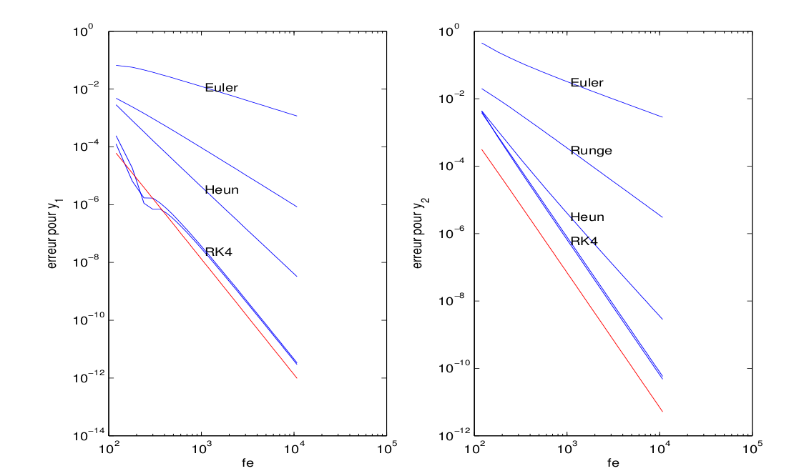
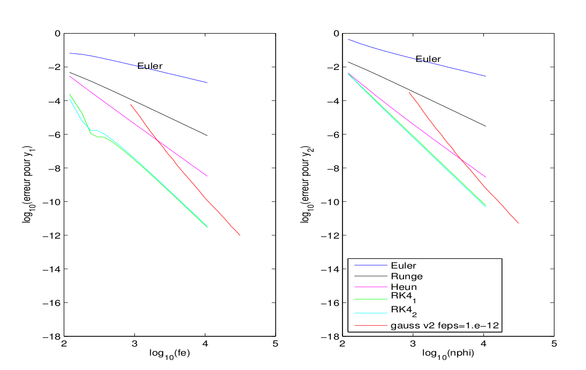
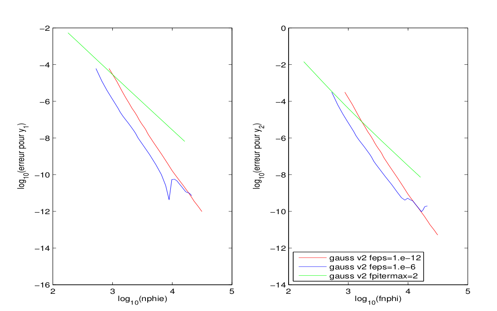

# Résultats avec Gauß

Figure 1 – Erreur globale en fonction du nombre d’évaluations. Pour
Gaußen abscisse 4N afin de vérifier l’ordre. ``fpitermax=15``, ``f\_eps=10^{-12}``.

Figure 2 – Erreur globale en fonction du nombre d’évaluations. ``fpitermax=15``, ``f\_eps=10^{-12}``.

Figure 3 – Erreur globale en fonction du nombre d’évaluations. ``fpitermax=15``, pour ``f\_eps=10^{-12}`` et ``f\_eps=10^{-6 }`` et ``fpitemmax=2``, pour ``f\_eps=10^{-14}``.