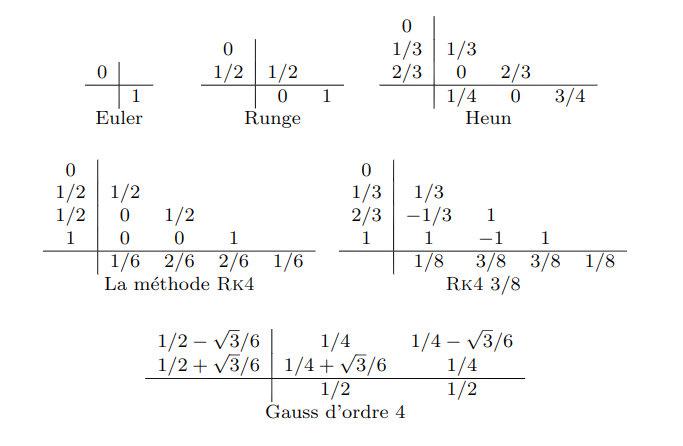
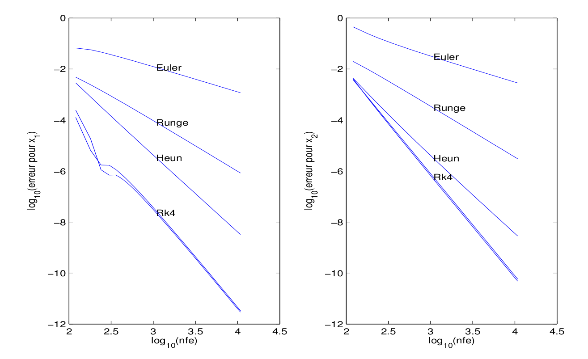
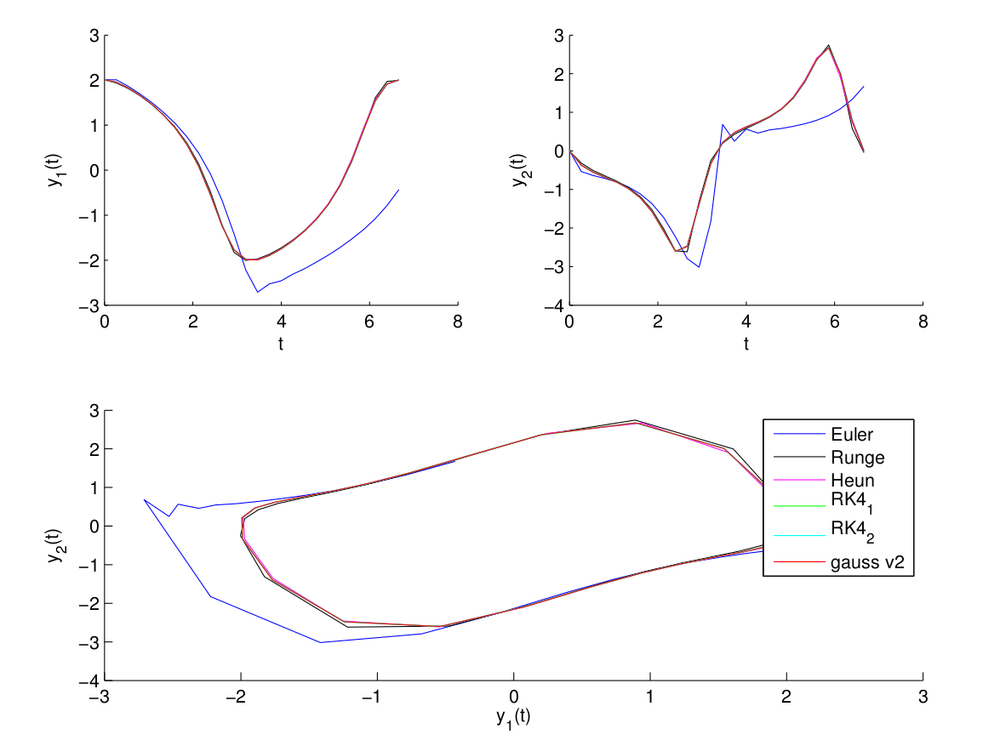

# Sujet TP ordre

## Introduction

Il est rappelé que les programmes doivent respecter les **bonnes pratiques de la programmation**. En particulier on vérifiera que les interfaces soient bien définies (paramètres en entrée, en sortie avec leurs types, les dimensions,...). Dans le cas contraire on mettra des **points négatifs** pour un maximum de 4 points.``\\``

On trouvera une version pdf de ce document à [cette adresse](http://gergaud.perso.enseeiht.fr/teaching/edo/edo_ordre.pdf).``\\``

L’objectif de ce projet est de réaliser les graphiques de la figure 1 concernant l’ordre qui seront compl ́et ́es avec les résultats obtenus pour le schéma implicite de Gauß à 2  ́etages (cf. cours sur les schémas implicites)``\\``

## Rappels

###  Schémas de Runge-Kutta

On rappelle les schémas classiques

FIGURE 1- Erreur globale en fonction du nombre d'évaluations, E. Hairer, S.P. Nørsett and G. Wanner, Tome I, page 140, ``\log _{10}(err)=C_{1}- p \log _{10}(n p h i)``

## Travail demandé
#### Ordre

L'équation différentielle considérée est l'équation de Van der Pol

``(I V P) \left\{\begin{array}{l}\dot{y}_{1}(t)=y_{2}(t) \\ \dot{y}_{2}(t)=\left(1-y_{1}^{2}(t)\right) y_{2}(t)-y_{1}(t) \\ y_{1}(0)=2.00861986087484313650940188 \\ y_{2}(0)=0 \end{array}\right.\\``

``t_{f}``=T=6.6632868593231301896996820305 ``\\``

La solution de ce problème de Cauchy est périodique de période ``T. \\``

Les programmes seront effectués en Julia. On demande que les appels aux sous-programmes se fassent ainsi :

- Pour les schémas explicites:
  **T,Y = ode_euler(phi, [t0 tf], y0, N)** où *T* est un vecteur colonne de longueur *N+1* et *Y* est de dimension *(N+1, n)*.

- Pour le schéma implicite de Gauß :
  **T, Y, nphi, ifail = ode\_gauss\_fp(phi,[t0 tf], y0, options)** respectivement **T, Y, nphi, ifail = ode_gauss newton(phi, [t0 tf], y0, options)**) pour la version point fixe (respectivement Newton) avec 
    - *options[1]* = N
    - *options[2]* = *nb\_itmax* , nombre d'itérations maximum pour le point fixe
    - *options[3]* = *f\_eps*, ``\varepsilon`` pour le test d'arrêt pour le point fixe
    - *nphi* = nombre d'évaluations du second membre de l'équation différentielle
    - *ifail[i]* =nombre d'itérations si le point fixe a convergé pour l'intervalle ``[t_{i-1}, t_{i}]`` et -1 sinon.
- L'interface pour la fonction phi sera: **ypoint = phi(t, y)** 

Les programmes d’intégration numérique par les méthodes explicites ne devront comporter qu’une seule boucle.

On demande pour cette équation:
1. de réaliser les graphique de la figure 2 qui tracent les deux composantes de la solution et le plan de phase pour **N=25** . Pour Gauß on prendra **nb\_itmax=15** et **f\_eps=1.e-12**.
  On fera 2 versions pour Gauß :
  une version point fixe et une version Newton.
2. de réaliser les graphiques de la figure 1 Pour les schémas explicites on mettra en abscisse le vecteur (**en notation Julia**)  ``\log_{10}``([120:60:1080 1200:600:10800]). On rajoutera sur ces graphiques les résultats obtenus pour le schéma implicite de Gauß en prenant comme nombre de pas le vecteur [120:60:1080 1200:600:10800] / 4 et comme valeurs pour les paramètres nb_itmax=15 et f\_eps=1.e-12
3. On fera une deuxième figure avec les résultats correspondant au schéma implicite de Gauß pour
  1. *nb\_itmax=15 et f_eps=1.e-12*
  2. *nb\_itmax=2 et f_eps=1.e-12*
  3. *nb\_itmax=15 et f_eps=1.e-6*

#### Rendu

Le travail en TP est individuel. Deux tests seront effectués, le premier lors du deuxième TP, le deuxième lors de dernière séance de TP. Le rendu définitif
est à rendre le soir du dernier TP contiendra :
- les graphiques obtenus au format pdf ; les sources des programmes qui seront mis dans un répertoire *< noms >*. le fichier contenant l'archive (*< noms >.tar*), sera envoyé à votre enseignant en TP (gergaud@enseeiht.fr ou damien.goubinat@enseeiht.fr).
Dans le courriel vous mentionnerez le nom du fichier Julia permettant d’obtenir les courbes résultats.

## Résultats

On trouveras aussi ci-après les figures des solutions pour N=25 pas.

Figure 2- Solution de l’équation de *Van der Pol*, composante 1 et 2 et plan de phase, pour les schémas de Runge-Kutta avec N = 25, pour Gauß nb itmax = 15 et f\_eps = 1.e-12.